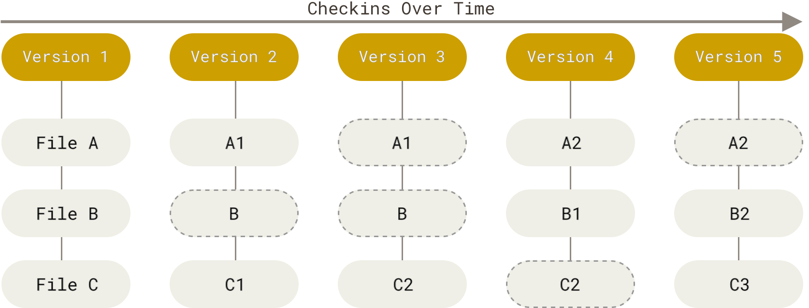
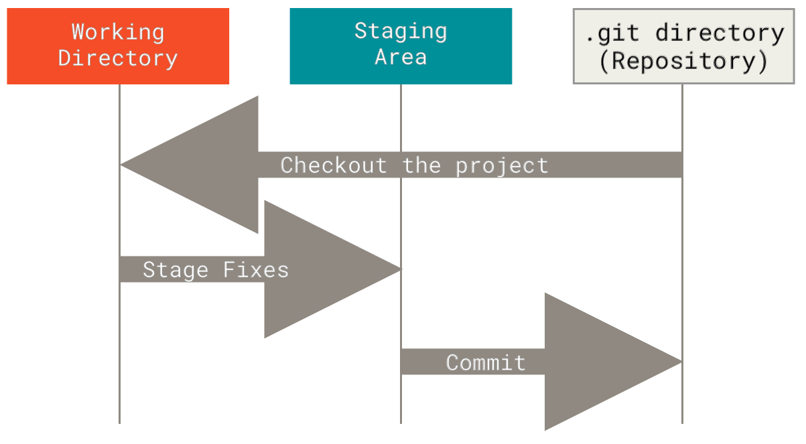
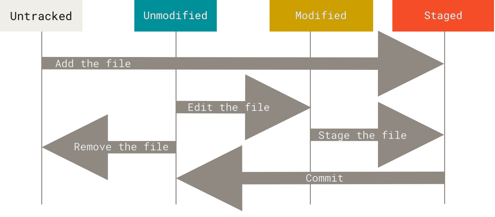
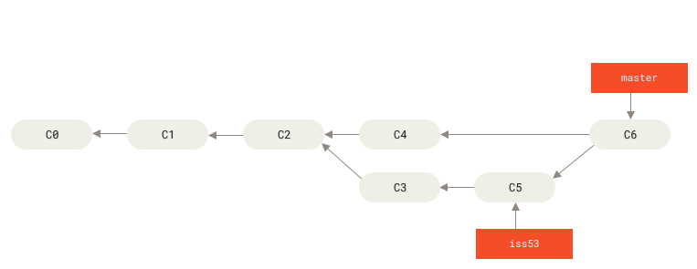
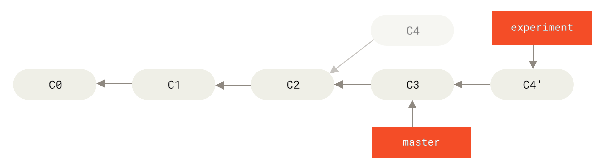

# git 培训

## git 是什么

**Git 是一款分布式版本控制软件**。版本控制是一种随着时间保存更改而不覆盖之前版本的方法；分布式意味着每个使用 Git 仓库的开发者都拥有整个仓库的副本——每一次提交、每个分支、每一个文件。

### git 的存储方式

Git 把数据看作是对小型文件系统的一系列快照。在 Git 中，每当你提交更新或保存项目状态时，它基本上就会对当时的全部文件创建一个快照并保存这个快照的索引。为了效率，如果文件没有修改，Git 不再重新存储该文件，而是只保留一个链接指向之前存储的文件。



Git 中所有的数据在存储前都计算校验和，然后以校验和来引用，这意味着不可能在 Git 不知情时更改任何文件内容或目录内容。 Git 用以计算校验和的机制叫做 SHA-1 散列，这是一个由 40 个十六进制字符（0-9 和 a-f）组成的字符串，基于 Git 中文件的内容或目录结构计算出来， SHA-1 哈希看起来是这样：
```bash
24b9da6552252987aa493b52f8696cd6d3b00373
```

### 文件的状态与仓库

Git 有三种状态，你的文件可能处于其中之一： 
- **已修改 (modified)** 表示修改了文件，但还没保存到数据库中。
- **已暂存 (staged)** 表示对一个已修改文件的当前版本做了标记，使之包含在下次提交的快照中。
- **已提交 (committed)** 表示数据已经安全地保存在本地数据库中。

这会让我们的 Git 项目拥有三个阶段：
- **工作区**是对项目的某个版本独立提取出来的内容。这些从 Git 仓库的压缩数据库中提取出来的文件，放在磁盘上供你使用或修改。
- **暂存区**是一个文件，保存了下次将要提交的文件列表信息，一般在 Git 仓库目录中。
- **Git 仓库目录**是 Git 用来保存项目的元数据和对象数据库的地方。这是 Git 中最重要的部分，从其它计算机克隆仓库时，复制的就是这里的数据。



基本的 Git 工作流程如下：
1. 在工作区中新建或修改文件。
2. 将你想要下次提交的更改选择性地暂存，这样只会将更改的部分添加到暂存区。
3. 提交更新，找到暂存区的文件，将快照永久性存储到 Git 目录。



###### 参考资料

- [Pro Git](https://git-scm.com/book/zh/v2)
- [Git Guides](https://github.com/git-guides)
- [续本达老师的讲义](https://hep.tsinghua.edu.cn/~orv/teaching/physics-data/p0.pdf)

## git 怎么用

### git 安装

可进入 [git 官网](https://git-scm.com/install/)查找不同操作系统的安装链接或命令。
- 对于 windows(x64) 用户，可以点击[此链接](https://github.com/git-for-windows/git/releases/download/v2.52.0.windows.1/Git-2.52.0-64-bit.exe)下载 git (2.52.0) ，之后安装即可；
- 对于 Debian/Ubuntu 用户，可以使用以下命令安装 git ：
```bash
sudo apt update
sudo apt install git
```

### git 用户信息配置与 ssh 配置

#### git 用户信息配置

在初次运行 git 前，你应该完成一些配置，最基本的是要设置用户信息，即你的用户名和邮件地址，每一个 Git 提交都会使用这些信息，它们会写入到你的每一次提交中，不可更改。

你可以使用如下命令配置（当你想针对特定项目使用不同的用户名称与邮件地址时，可以在那个项目目录下运行没有 `--global` 选项的命令来配置）
```bash
git config --global user.name "你的用户名"
git config --global user.email "你的邮箱"
```
你可以使用如下命令查看你的所有 git 配置信息
```bash
git config --list --global  # 全局的 git 配置信息
git config --list  # 当前仓库的 git 配置信息
```

#### ssh 密钥对生成

为了方便与远程仓库之间的通信，我们可以使用 ssh ，其基本原理是生成一个非对称密钥对，一个公钥（一般以 `.pub` 为后缀），可以上传到 git 平台或服务器上，一个私钥（与公钥名称相同，没有 `.pub` 后缀），自己保密。平台用公钥加密，你可以用对应的私钥解密，反之亦然，这样就能建立安全的通讯。 

你可以使用如下命令生成一个 ssh 密钥对：
```bash
ssh-keygen -t ed25519
```
该命令可以在后面使用 `-C` 参数添加注释，譬如你的邮箱信息，也可以不加。输入完成后，会提示你选择密钥保存位置，默认为 `~/.ssh/id_ed25519` ，之接按回车选择默认位置即可；然后会让你设置一个密码（每次使用密钥时需要输入），一般情况下直接留空就行，因为别人一般拿不到你的私钥，所以推荐直接按两次回车；之后你的 ssh 密钥对就被成功生成了，你可以使用如下命令查看你的公钥：
```bash
cat ~/.ssh/id_ed25519.pub
```

### 本地操作

###### 参考资料

- [git cheat sheet](https://education.github.com/git-cheat-sheet-education.pdf)
- [git 备忘单](https://training.github.com/downloads/zh_CN/github-git-cheat-sheet/)

#### 基本命令

- 初始化一个 git 仓库：
```bash
git init
```
- 查看 git 状态：
```bash
git status
```
- 比对更改内容：
```bash
git diff  # 比对已修改但未暂存的
git diff --staged  # 比对已暂存但未提交的
```
- 查看 git 历史：
```bash
git log
```
也可以使用 `tig` ：
```bash
# 安装 (debian/ubuntu)
sudo apt update
sudo apt install tig
# 使用
tig
```
- 暂存文件：
```bash
git add [file]  # 暂存某一文件
git add .  # 暂存所有文件
```
- 提交：
```bash
git commit -m "[commit message]"
```
- 撤回提交：
```bash
git revert HEAD  # 撤回最近的提交
git revert [commit]  # 撤回某个 commit , 但要注意如果不是按顺序的, 可能会引起冲突
```

###### 参考资料

- [约定式提交](https://www.conventionalcommits.org/zh-hans/v1.0.0/)
- [管理大型文件](https://docs.github.com/zh/repositories/working-with-files/managing-large-files/)

#### git 特殊文件

- `.gitignore`：告诉 Git 哪些文件或目录不应该被跟踪，常用于忽略编译产物、临时文件、本地配置等。其基本特征与语法为：
  - `.gitignore` 文件按目录层级生效：仓库根的规则对整个仓库有效，子目录下的 `.gitignore` 只影响其子树。
  - 路径层级越深的 `.gitignore` 优先级越高， `.gitignore` 文件中越靠后优先级越高。
  - 每行一个规则，表示忽略的文件或目录，以 `#` 开头为注释。
  - 以 `/` 开头表示 Git 仓库的根目录（而非系统的根目录），以非 `/` 开头表示相对于 `.gitignore` 所在目录的路径。
  - `*` 通配符匹配任意字符，不包括目录分隔符 `/` 。
  - `**` 通配符匹配任意层级的目录。
  - 用 `!` 开头表示否定规则，用来重新追踪被忽略的路径。
  - 用 `/` 结尾表示这是一个目录。
- `.gitkeep`：这是一个约定俗称的文件，目的是让 Git 能够跟踪一个空目录。因为 **Git 不跟踪空目录**，放一个（通常空的）`.gitkeep` 文件到目录中，便能使目录被提交到仓库，从而保留该目录结构。
- `.gitattributes`：可以针对特定的路径配置某些设置项，这样 Git 就只对特定的子目录或子文件集运用它们。详见 [Git 属性](https://git-scm.com/book/zh/v2/%e8%87%aa%e5%ae%9a%e4%b9%89-Git-Git-%e5%b1%9e%e6%80%a7)。
- `.gitmodules`：记录每个子模块的路径和 URL。详见 [Git 子模块](https://git-scm.com/book/zh/v2/Git-%e5%b7%a5%e5%85%b7-%e5%ad%90%e6%a8%a1%e5%9d%97)。

#### 分支管理

几乎所有的版本控制系统都以某种形式支持分支。使用分支意味着你可以把你的工作从开发主线上分离开来，以免影响开发主线。



一些常用的命令如下：
- 查看所有的分支：
```bash
git branch
```
- 创建一个新分支：
```bash
git branch [branch-name]
# 也可以使用以下命令, 它们会同时切换到新创建的分支
git checkout -b [branch-name]
git switch -c [branch-name]
```
- 切换分支：
```bash
git checkout [branch-name]
git switch [branch-name]
```
- 删除分支：
```bash
git branch -d [branch-name]
```
- 合并分支：
  -  `merge` 命令会把两个分支的最新快照以及二者最近的共同祖先进行三方合并，合并的结果是生成一个新的快照并提交。
  - `rebase` 命令会将提交到某一分支上的所有修改都移至另一分支上，这样可以保持提交记录为一条直线（见下图）。
```bash
git merge [branch-name]
git rebase [branch-name] 
```


###### 参考资料

- [Git 分支 - 分支简介](https://git-scm.com/book/zh/v2/Git-%e5%88%86%e6%94%af-%e5%88%86%e6%94%af%e7%ae%80%e4%bb%8b)
- [Git 分支 - 分支的新建与合并](https://git-scm.com/book/zh/v2/Git-%e5%88%86%e6%94%af-%e5%88%86%e6%94%af%e7%9a%84%e6%96%b0%e5%bb%ba%e4%b8%8e%e5%90%88%e5%b9%b6)
- [Git 分支 - 变基](https://git-scm.com/book/zh/v2/Git-%e5%88%86%e6%94%af-%e5%8f%98%e5%9f%ba)
- [学习 git 分支](https://learngitbranching.js.org/)（这是一个闯关游戏式的网页）

### 远程仓库

为了能在任意 Git 项目上协作，你需要知道如何管理自己的远程仓库。远程仓库是指托管在因特网或其他网络中的你的项目的版本库。你可以有好几个远程仓库，通常有些仓库对你只读，有些则可以读写。与他人协作涉及管理远程仓库以及根据需要推送或拉取数据。

一些常用的命令如下：
- 克隆一个远程仓库：
```bash
git clone [url] [path]
```
- 查看当前的远程仓库：
```bash
git remote
git remote -v  # 可以显示 fetch/push url
```
- 添加远程仓库：
```bash
git remote add [alias] [url]
```
- 删除远程仓库
```bash
git remote remove [alias]
git remote rm [alias]
```
- 修改远程仓库名字
```bash
git remote rename [old-alias] [new-alias]
```
- 修改远程仓库的 url ：
```bash
git remote set-url [alias] [url]
```
- 获取远程的所有分支、标签（不会修改当前工作区）：
```bash
git fetch [alias]
```
- 拉取远程仓库的修改：
```bash
git pull [alias] [branch]
# 该命令等价于以下两条命令的组合
git fetch [alias]
git merge [alias]/[branch]
```
- 向远程仓库推送修改（有时可能需要删除或覆盖掉远程仓库的一些记录，此时可能会要用到 `-f` 或 `--force` ，但**一般情况下尤其是多人协作的情况下不要使用强推**！）：
```bash
git push [alias] [branch]
# 若远程还没有该分支, 或是未建立绑定关系, 可以使用以下任一命令
git push -u [alias] [branch]
git push --set-upstream [alias] [branch]
```

###### 参考资料

- [Git 基础 - 远程仓库的使用](https://git-scm.com/book/zh/v2/Git-%e5%9f%ba%e7%a1%80-%e8%bf%9c%e7%a8%8b%e4%bb%93%e5%ba%93%e7%9a%84%e4%bd%bf%e7%94%a8)
- [Git 基础 - 打标签](https://git-scm.com/book/zh/v2/Git-%e5%9f%ba%e7%a1%80-%e6%89%93%e6%a0%87%e7%ad%be)
