## VSCode 安装及汉化

VSCode 是微软推出的一款轻量级编辑器，它本身**只是一款文本编辑器**而已，并**不是一个集成开发环境（IDE）**，几乎所有功能都是以插件扩展的形式存在的。

请访问 VSCode 官网安装（[Visual Studio Code - The open source AI code editor | Your home for multi-agent development](https://code.visualstudio.com/)） 


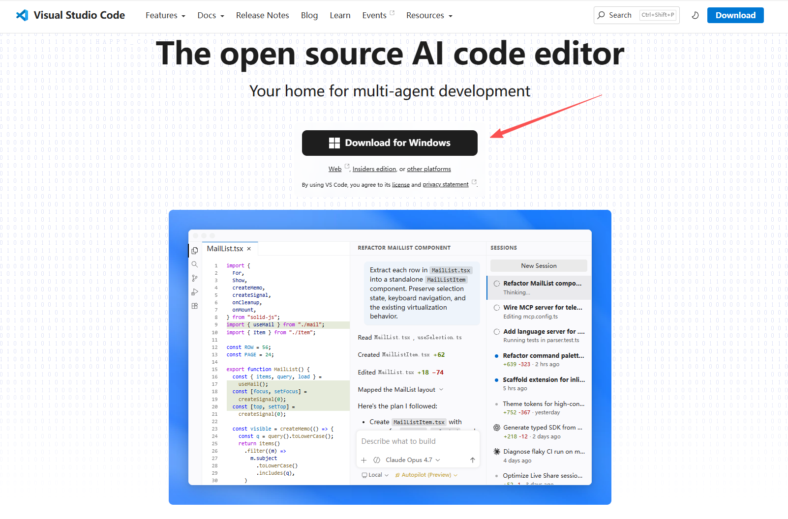


附加任务保持默认即可，可以手动勾选创建桌面快捷方式。


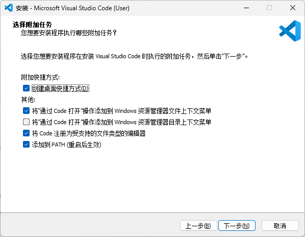


安装完成后，打开 VSCode，在扩展商店中搜索 "Chinese"，在结果里找到 "Chinese (Simplified) （简体中文）..."（作者是 Microsoft），点击"Install"安装。


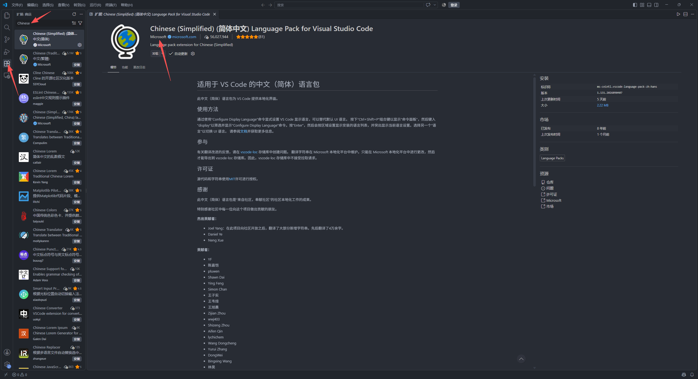

安装完成后右下角会弹出提示"是否重启以切换语言"，点击"更改语言并重启"（Change Language and Restart），重启后整个界面就变成中文了。


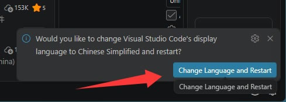


如果安装后没有自动弹出提示，可以按 `Ctrl+Shift+P` 打开命令面板，输入 Configure Display Language（配置显示语言）：


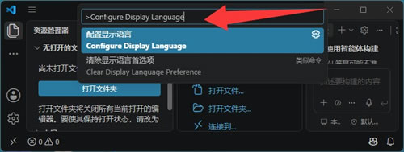


回车后在列表里选择"中文（简体）"，再重启一次即可。


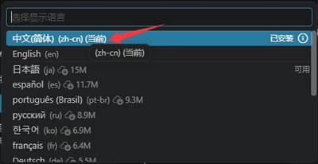

## WSL 安装

快捷键 `Win + R` 打开 "运行"，输入 `OptionalFeatures`，找到 "适用于 Linux 的 Windows 子系统" 并勾选，重启电脑。


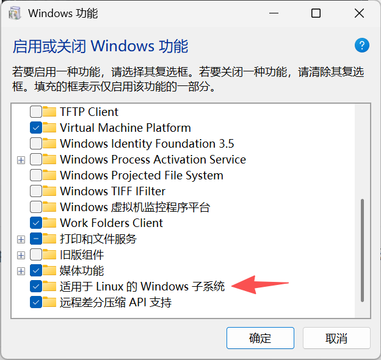


按下 `Win+X` ，选择 "终端（管理员）"（如果没有，选 "Windows Powershell（管理员）"）

在终端中输入以下命令

```powershell
wsl --install Debian
```


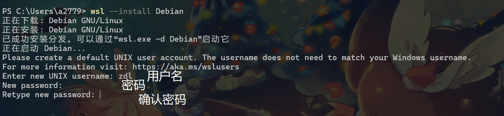


安装过程中需要输入用户名和密码，输入密码时输入的密码不在终端中显示是正常的。


安装完成后，输入以下命令确认是否安装成功

```powershell
wsl -l -v
```


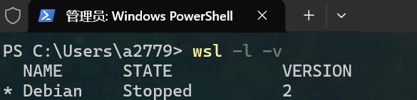


安装成功后，就可以在终端中输入 `wsl` 直接进入子系统了。


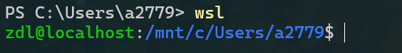

## 在 VSCode 使用 WSL


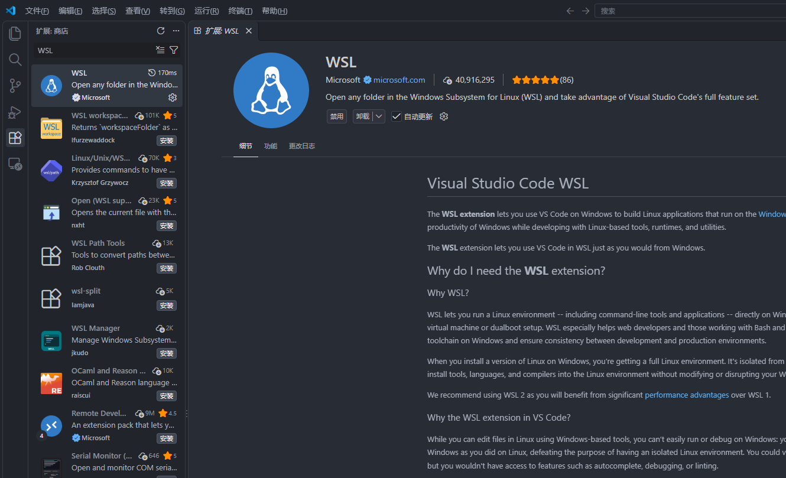


在扩展商店中搜索 `WSL` 安装扩展。安装完成后，按下 `Ctrl + Shift + P`，搜索并选择 `WSL: Connect to WSL` 即可在 VSCode 中操作子系统的文件。


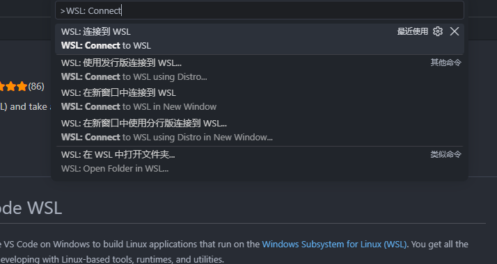